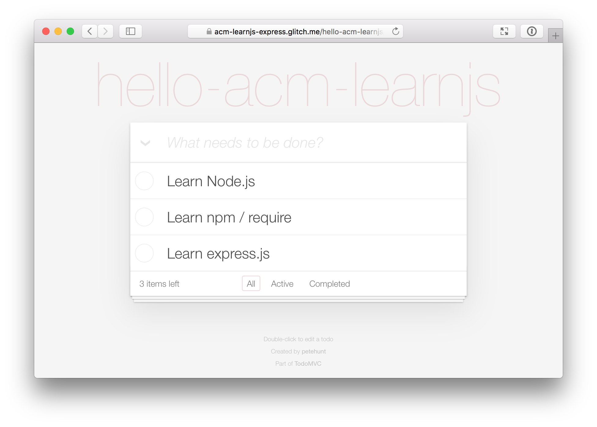
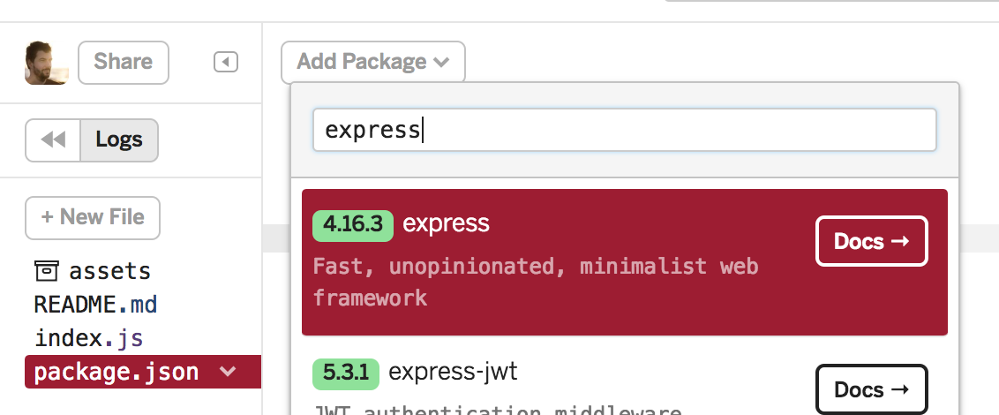
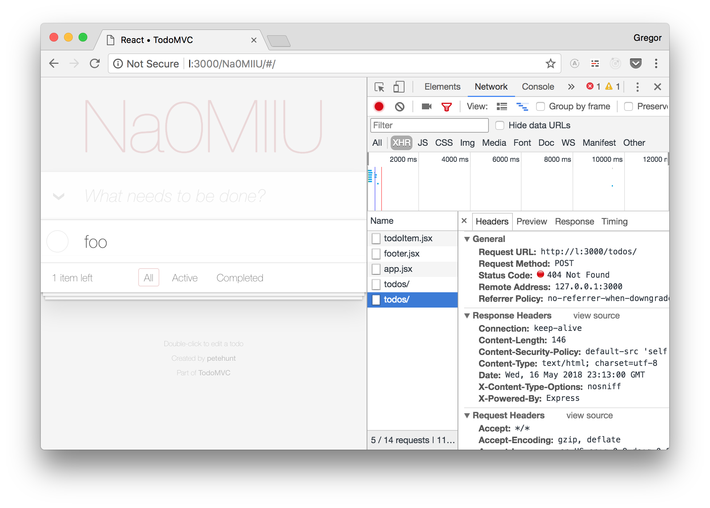

# Session 4: Node.js & Express

## Essential Links

- Slides: https://docs.google.com/presentation/d/1Dw3Z6WKrhyq3QGHXrzcGrASILd-6B-_vTwqLsR77CHY/edit#slide=id.g3b13d493a6_0_348
- Minimal Node.js Server: https://glitch.com/edit/#!/nodejs-server-starter
- Demo: https://glitch.com/edit/#!/acm-learnjs-express

## The project

Open https://acm-learnjs-express.glitch.me/ to check out the final result.



This week we will create a server for a todo web application. Most of the web
application lives in the frontend, similar to what you learned in [Session 3](https://github.com/acm-learnjs-sp18/session-3).

The server does 4 things

1. When you open https://acm-learnjs-express.glitch.me/ it will redirect you to
   a random path – the path of your todo list. You can navigate to a path yourself
   if you want a custom name, e.g. https://acm-learnjs-express.glitch.me/hello-acm-learnjs.
2. It will serve the files for the `frontend` folder: HTML, CSS and JavaScript.
3. It stores an array of todo objects for the current list.
4. It loads the array of todo objects for the current list.


## Stage 1: Getting Started

We will edit the app directly in the browser, using [glitch.com](https://glitch.com/).
Open the code at https://glitch.com/edit/#!/acm-learnjs-express-starter. Click on “Remix this 🎤”
to get your own copy of the app.

Rename the `backend_starter` folder to `backend`. You can use the `backend_final` folder
as reference if you get stuck along the way.

In `backend/server.js` you see the minimal code to create a server with Node.js.

```js
require('http').createServer((request, response) => {
  response.end('Hello, world!')
}).listen(8000)
```

The `require('http')` returns Node.js’ [http module](https://nodejs.org/api/http.html).
Among other things it returns the [`.createServer` method](https://nodejs.org/api/http.html#http_http_createserver_options_requestlistener)
which in turn returns a server instance. We directly call `.listen(8000)` on it
which starts the server and starts listening on requests on port `8000`.

## Stage 2: Use the express module

To build a more complex server we will use the [Express server framework](http://expressjs.com/).
While the `http` module comes with Node.js, `express` needs to be installed.

Open the `package.json` file, press on "Add package", search for "express" and click on the first result.



Now that `"express"` is listed in the `"dependencies"` you can require it in
your code. Replace the `backend/server.js` code with the code below

```js
// require express framework
const express = require('express')

// initialize the express server
const app = express()

// Show "Hello, world!" at the root path
app.get('/', (req, res) => {
  res.end('Hello, world!')
})

// Start the server, listen to port 3000
app.listen(3000, () => console.log('App listening on port 3000!'))
```

It works mostly like the previous code, with the difference that it won’t show
"Hello, world!" if you navigate to another path than the root path `/`.

**What you learned**

- Install an [npm](https://www.npmjs.com/) module
- Create a minimal server with the Express server framework
- Create a so called route handler for `GET /`.

## Stage 3: Redirect to a random path and show frontend

Express has a function to redirect a request to another URL built-in, it's called
[`res.redirect`](https://expressjs.com/en/api.html#res.redirect).

To get a random string we use another module, called [`random-string`](https://www.npmjs.com/package/random-string).
Install it the same way you did in the previous step with `express`. Then add

```js
const randomString = require('random-string')
```

to the top of `backend/server.js`. Now replace the current `GET /` route handler
with this

```js
app.get('/', (req, res) => {
  const uniquId = randomString({length: 7})
  res.redirect(`/${uniquId}`)
})
```

When you click on the "Show" button, you will get redirected to a random path with
7 characters and see a "Page Not Found" error.

Next, we want to show the frontend app instead of the error. For that we use the
[`express.static` middleware](https://expressjs.com/en/starter/static-files.html).
A middleware is a piece of code that can be registered to be run before your own
route handlers. In our case we want it to serve all static files from the `frontend/`
folder for any path. Add this code below

```js
// serve static HTML, CSS & JavaScript when a path is set.
app.use('/:id', express.static('frontend'))
```

`:id` is a route parameter. You can access it in your route handler if you like,
in our case we just use it as a placeholder for our random strings.

When you click on show again it should now show the rendered frontend app.

**What you learned**

- How to generate random strings with the `random-string` module
- How to redirect requests in Express route handlers
- How to serve static files with `express.static`

## Stage 4: Persisting todos

When you add some todos and reload the page, all your todos are gone, because
we don’t save them anywhere. When you open the network tab of your browser’s
developer tools, you will see failing requests each time you create or edit
a todo



We will write all todos into a single `*.json` file. For that we will use the
[`json-store` module](https://www.npmjs.com/package/json-store). Install it,
then add the code to the top of `backend/server.js`

```js
const storeDataPath = require('path').join(__dirname, '..', '.data', 'store.json')
const store = JSONStore(storeDataPath)
```

The above code will create a `.data/store.json` file if it does not exist yet.
The `store` object has `store.set()` and `store.get()` methods that we can use
to save and retrieve todos.

First, let’s create a `GET /todos` route handler which will return an array of
todos for the current route

```js
const getListId = require('./get-list-id')
app.get('/todos', (req, res) => {
  const listId = getListId(req)
  res.json(store.get(listId) || [])
})
```

The `getListId` reads out the current path from the `req` (request) object. So
if you are at `https://your-app-name.glitch.me/abcd123` then `getListId(req)`
will return `abcd123`.

Next, we create a `POST /todos` handler. `POST` is another [http verb](https://developer.mozilla.org/en-US/docs/Web/HTTP/Methods) that is usually
used to ask the server to store new data.

```js
const bodyParser = require('body-parser')
app.post('/todos', bodyParser.json(), (req, res) => {
  const listId = getListId(req)
  store.set(listId, req.body)
  res.end()
})
```

The `body-parser` module gets installed together with `express`. It returns a
middleware just like `app.static()`. In this case it parses the request body
and sets `req.body` to its value. In our case that will be the array of current
todos.

That’s it, you build a full stack web application with express, congratulations!

**What you learned**

- How to persist and receive data with `json-store`
- How to return an array in a `GET` route handler
- How to handle a request body in a `POST` route handler

## Bonus

Few things you can do from here:

1. Create a static landing page with a button to create a new todo list
   instead of the automated redirect.
2. Preset a todo list with default todos
3. Be creative :)

## Credit

The code is based on [React TodoMVC with Express Backend Example](https://github.com/tastejs/todomvc/tree/gh-pages/examples/react).

Differences:

- The store method is asynchronous
- Todos are read from/written to a server, which is written using [express.js](http://expressjs.com/)
- Data is persisted using [json-store](https://github.com/juliangruber/json-store)
